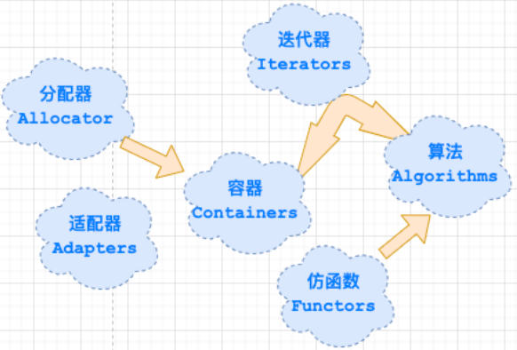

# 1.概述

长久以来，软件界一直希望建立一种可重复利用的东西，以及一种得以制造出“可重复运用的东西”的方法，从函数(functions)，类别(classes),函数库(function libraries),类别库(class libraries)、各种组件，从模块化设计，到面向对象(object oriented )，为的就是复用性的提升。

复用性必须建立在某种标准之上。但是在许多环境下，就连软件开发最基本的数据结构(data structures) 和算法(algorithm)都未能有一套标准。大量程序员被迫从事大量重复的工作，竟然是为了完成前人已经完成而自己手上并未拥有的程序代码，这不仅是人力资源的浪费，也是挫折与痛苦的来源。

为了建立数据结构和算法的一套标准，并且降低他们之间的耦合关系，以提升各自的独立性、弹性、交互操作性(相互合作性,interoperability),诞生了STL。

STL(Standard Template Library,标准模板库)，是惠普实验室开发的一系列软件的统称。现在主要出现在 c++中，但是在引入 c++之前该技术已经存在很长时间了。

STL 从广义上分为: **容器**(container) **算法**(algorithm) **迭代器**(iterator)。

容器和算法之间通过迭代器进行无缝连接。STL 几乎所有的代码都采用了模板类或者模板函数，这相比传统的由函数和类组成的库来说提供了更好的代码重用机会。

STL(Standard Template Library)标准模板库,在我们 c++标准程序库中隶属于 STL 的占到了 80%以上。

# 2.STL六大组件介绍

STL提供了六大组件，彼此之间可以组合套用，这六大组件分别是:**容器**、**算法**、**迭代器**、**仿函数**、**适配器（配接器）**、**空间配置器**。

**容器（ containers）**：**各种数据结构**，如 vector, list, deque, set, map ⽤来存放数据。从实现的⻆度来看，STL 容器是⼀种 class template。

**算法（ algorithms）**：各种常⽤的算法如 sort, search, copy, erase…从实现⻆度来看， STL 算法是⼀种function template。

**迭代器（ iterators）**：扮演容器与算法之间的胶合剂，是所谓的“泛型指针”，共有五种类型。从实现⻆度来看，迭代器是⼀种将 operator \*, operator ->, operator++, operator– 等指针相关操作予以重载的class template。所有STL容器都附带有自己专属的迭代器，只有容器的设计者才知道如何遍历自己的元素。原生指针(native pointer)也是一种迭代器。

**仿函数（ functors）**：**⾏为类似函数，可以作为算法的某种策略**。从实现⻆度来看，仿函数是⼀种᯿载了operator() 的 class 或class template。

**适配器（ adapters）**：**⼀种⽤来修饰容器或仿函数或迭代器接⼝的东⻄**。例如 STL 提供的 queue 和 stack，虽然看似容器，其实只能算是⼀种容器适配器，因为它们的底部完全借助 deque，所有操作都由底层的deque 供应。

**配置器（ allocator）**：负责空间配置与管理，从实现⻆度来看，配置器是⼀个实现了动态空间配置、空间管理、空间释放的 class template。

STL六大组件的交互关系，容器通过空间配置器取得数据存储空间，算法通过迭代器存储容器中的内容，仿函数可以协助算法完成不同的策略的变化，适配器可以修饰仿函数。

# 3.STL优点

- STL 是 C++的一部分，因此不用额外安装什么，它被内建在你的编译器之内。
- STL 的一个重要特性是将**数据和操作分离**。**数据由容器类别加以管理，操作则由可定制的算法定义**。迭代器在两者之间充当“粘合剂”,以使算法可以和容器交互运作。
- 程序员可以不用思考 STL 具体的实现过程，只要能够熟练使用 STL 就 OK 了。这样他们就可以把精力放在程序开发的别的方面。
- STL 具有高可重用性，高性能，高移植性，跨平台的优点。
  - 高可重用性：STL 中几乎所有的代码都采用了模板类和模版函数的方式实现，这相比于传统的由函数和类组成的库来说提供了更好的代码重用机会。
  - 高性能：如 map 可以高效地从十万条记录里面查找出指定的记录，因为 map 是采用红黑树的变体实现的。
  - 高移植性：如在项目 A 上用 STL 编写的模块，可以直接移植到项目 B 上。
