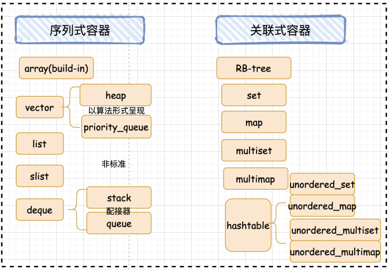

# 1.概述

几乎可以说，任何特定的数据结构都是为了实现某种特定的算法。STL容器就是将运用最广泛的一些数据结构实现出来。

常用的数据结构：**数组**(array) , **链表**(list), tree(**树**)，**栈**(stack), **队列**(queue), **集合**(set),**映射表**(map), 根据数据在容器中的排列特性，这些数据分为序列式容器和关联式容器两种。

- **序列式容器**强调值的排序，序列式容器中的每个元素均有固定的位置，除非用删除或插入的操作改变这个位置。Vector容器、Deque容器、List容器等。
- **关联式容器**是非线性的树结构，更准确的说是二叉树结构。各元素之间没有严格的物理上的顺序关系，也就是说元素在容器中并没有保存元素置入容器时的逻辑顺序。关联式容器另一个显著特点是：在值中选择一个值作为关键字key，这个关键字对值起到索引的作用，方便查找。Set/multiset容器 Map/multimap容器

# 2.STL的使用时机

| .      | vector | deque | list | set | multiset | map       | multimap |
| ------ | ------ | ----- | ---- | --- | -------- | --------- | -------- |
| 典型内存结构 | 单端数组   | 双端数组  | 双向链表 | 二叉树 | 二叉树      | 二叉树       | 二叉树      |
| 可随机存取  | 是      | 是     | 否    | 否   | 否        | 对key而言：不是 | 否        |
| 元素搜寻速度 | 慢      | 慢     | 非常慢  | 快   | 快        | 对key而言：快  | 对key而言：快 |
| 元素安插移除 | 尾端     | 头尾两端  | 任何位置 | -   | -        | -         | -        |

vector的使用场景：比如软件历史操作记录的存储，经常要查看历史记录，比如上一次的记录，上上次的记录，但却不会去删除记录，因为记录是事实的描述。

deque的使用场景：比如排队购票系统，对排队者的存储可以采用deque，**支持头端的快速移除，尾端的快速添加**。如果采用vector，则头端移除时，会移动大量的数据，速度慢。

vector与deque的比较：

1. vector.at()比deque.at()效率高，比如vector.at(0)是固定的，deque的开始位置 却是不固定的。
2. 如果有大量释放操作的话，vector花的时间更少，这跟二者的内部实现有关。
3. deque支持头部的快速插入与快速移除，这是deque的优点。

list的使用场景：比如公交车乘客的存储，随时可能有乘客下车，**支持频繁的不确实位置元素的移除插入**。

set的使用场景：比如对手机游戏的个人得分记录的存储，**存储要求从高分到低分的顺序排列**。

map的使用场景：比如按ID号存储十万个用户，想要快速要通过ID查找对应的用户。**二叉树的查找效率，这时就体现出来了**。如果是vector容器，最坏的情况下可能要遍历完整个容器才能找到该用户。

# 3.API概述

## 3.1 array

array 是固定大小的顺序容器，它们保存了一个以严格的线性顺序排列的特定数量的元素。

| 方法                           | 含义                                                    |
| ---------------------------- | ----------------------------------------------------- |
| begin                        | 返回指向数组容器中第一个元素的迭代器                                    |
| end                          | 返回指向数组容器中最后一个元素之后的理论元素的迭代器                            |
| rbegin                       | 返回指向数组容器中最后一个元素的反向迭代器                                 |
| rend                         | 返回一个反向迭代器，指向数组中第一个元素之前的理论元素                           |
| cbegin                       | 返回指向数组容器中第一个元素的常量迭代器（const\_iterator）                 |
| cend                         | 返回指向数组容器中最后一个元素之后的理论元素的常量迭代器（const\_iterator）         |
| crbegin                      | 返回指向数组容器中最后一个元素的常量反向迭代器（const\_reverse\_iterator）     |
| crend                        | 返回指向数组中第一个元素之前的理论元素的常量反向迭代器（const\_reverse\_iterator） |
| size                         | 返回数组容器中元素的数量                                          |
| max\_size                    | 返回数组容器可容纳的最大元素数                                       |
| empty                        | 返回一个布尔值，指示数组容器是否为空                                    |
| operator\[]                  | 返回容器中第 n（参数）个位置的元素的引用                                 |
| at                           | 返回容器中第 n（参数）个位置的元素的引用                                 |
| front                        | 返回对容器中第一个元素的引用                                        |
| back                         | 返回对容器中最后一个元素的引用                                       |
| data                         | 返回指向容器中第一个元素的指针                                       |
| fill                         | 用 val（参数）填充数组所有元素                                     |
| swap                         | 通过 x（参数）的内容交换数组的内容                                    |
| get（array）                   | 形如 `std::get<0>(myarray)`；传入一个数组容器，返回指定位置元素的引用        |
| relational operators (array) | 形如 `arrayA > arrayB`；依此比较数组每个元素的大小关系                  |

## 3.2 vector

vector 是表示可以改变大小的数组的序列容器。

| 方法                            | 含义                                                                             |
| ----------------------------- | ------------------------------------------------------------------------------ |
| vector                        | 构造函数                                                                           |
| \~vector                      | 析构函数，销毁容器对象                                                                    |
| operator=                     | 将新内容分配给容器，替换其当前内容，并相应地修改其大小                                                    |
| begin                         | 返回指向容器中第一个元素的迭代器                                                               |
| end                           | 返回指向容器中最后一个元素之后的理论元素的迭代器                                                       |
| rbegin                        | 返回指向容器中最后一个元素的反向迭代器                                                            |
| rend                          | 返回一个反向迭代器，指向中第一个元素之前的理论元素                                                      |
| cbegin                        | 返回指向容器中第一个元素的常量迭代器（const\_iterator）                                            |
| cend                          | 返回指向容器中最后一个元素之后的理论元素的常量迭代器（const\_iterator）                                    |
| crbegin                       | 返回指向容器中最后一个元素的常量反向迭代器（const\_reverse\_iterator）                                |
| crend                         | 返回指向容器中第一个元素之前的理论元素的常量反向迭代器（const\_reverse\_iterator）                          |
| size                          | 返回容器中元素的数量                                                                     |
| max\_size                     | 返回容器可容纳的最大元素数                                                                  |
| resize                        | 调整容器的大小，使其包含 n（参数）个元素                                                          |
| capacity                      | 返回当前为 vector 分配的存储空间（容量）的大小                                                    |
| empty                         | 返回 vector 是否为空                                                                 |
| reserve                       | 请求 vector 容量至少足以包含 n（参数）个元素                                                    |
| shrink\_to\_fit               | 要求容器减小其 capacity（容量）以适应其 size（元素数量）                                            |
| operator\[]                   | 返回容器中第 n（参数）个位置的元素的引用                                                          |
| at                            | 返回容器中第 n（参数）个位置的元素的引用                                                          |
| front                         | 返回对容器中第一个元素的引用                                                                 |
| back                          | 返回对容器中最后一个元素的引用                                                                |
| data                          | 返回指向容器中第一个元素的指针                                                                |
| assign                        | 将新内容分配给 vector，替换其当前内容，并相应地修改其 size                                            |
| push\_back                    | 在容器的最后一个元素之后添加一个新元素                                                            |
| pop\_back                     | 删除容器中的最后一个元素，有效地将容器 size 减少一个                                                  |
| insert                        | 通过在指定位置的元素之前插入新元素来扩展该容器，通过插入元素的数量有效地增加容器大小                                     |
| erase                         | 从 vector 中删除单个元素（`position`）或一系列元素（`[first，last)`），这有效地减少了被去除的元素的数量，从而破坏了容器的大小 |
| swap                          | 通过 x（参数）的内容交换容器的内容，x 是另一个类型相同、size 可能不同的 vector 对象                             |
| clear                         | 从 vector 中删除所有的元素（被销毁），留下 size 为 0 的容器                                         |
| emplace                       | 通过在 position（参数）位置处插入新元素 args（参数）来扩展容器                                         |
| emplace\_back                 | 在 vector 的末尾插入一个新的元素，紧跟在当前的最后一个元素之后                                            |
| get\_allocator                | 返回与vector关联的构造器对象的副本                                                           |
| swap(vector)                  | 容器 x（参数）的内容与容器 y（参数）的内容交换。两个容器对象都必须是相同的类型（相同的模板参数），尽管大小可能不同                    |
| relational operators (vector) | 形如 `vectorA > vectorB`；依此比较每个元素的大小关系                                           |

## 3.3 deque

deque（\['dek]）（双端队列）是double-ended queue 的一个不规则缩写。deque是具有动态大小的序列容器，可以在两端（前端或后端）扩展或收缩。

| 方法             | 含义                                   |
| -------------- | ------------------------------------ |
| deque          | 构造函数                                 |
| push\_back     | 在当前的最后一个元素之后 ，在 deque 容器的末尾添加一个新元素   |
| push\_front    | 在 deque 容器的开始位置插入一个新的元素，位于当前的第一个元素之前 |
| pop\_back      | 删除 deque 容器中的最后一个元素，有效地将容器大小减少一个     |
| pop\_front     | 删除 deque 容器中的第一个元素，有效地减小其大小          |
| emplace\_front | 在 deque 的开头插入一个新的元素，就在其当前的第一个元素之前    |
| emplace\_back  | 在 deque 的末尾插入一个新的元素，紧跟在当前的最后一个元素之后   |

## 3.4 forward\_list

forward\_list（单向链表）是序列容器，允许在序列中的任何地方进行恒定的时间插入和擦除操作。

| 方法             | 含义                                 |
| -------------- | ---------------------------------- |
| forward\_list  | 返回指向容器中第一个元素之前的位置的迭代器              |
| cbefore\_begin | 返回指向容器中第一个元素之前的位置的 const\_iterator |

## 3.5 list

list，双向链表，是序列容器，允许在序列中的任何地方进行常数时间插入和擦除操作，并在两个方向上进行迭代。

## 3.6 stack

stack 是一种容器适配器，用于在LIFO（后进先出）的操作，其中元素仅从容器的一端插入和提取。

## 3.7 queue

queue 是一种容器适配器，用于在FIFO（先入先出）的操作，其中元素插入到容器的一端并从另一端提取。

## 3.8 priority\_queue

priority\_queue 又称为优先队列，其底层是用堆来进行实现的。在优先队列中，队首元素一定是当前队列中优先级最高的那一个。

可以在任何时候往优先队列里面加入 (push) 元素，而优先队列底层的数据结构堆 (heap) 会随时调整结构，使得每次的队首元素都是优先级最大的。

和队列不一样的是，优先队列没有 `front()` 函数与 `back()` 函数，而只能通过 `top()` 函数来访问队首元素（也可以称为堆顶元素），也就是优先级最高的元素。

## 3.9 set / unordered\_set

set 是按照特定顺序存储唯一元素的容器。

## 3.10 map / unordered\_map

map 是关联容器，按照特定顺序存储由 key value (键值) 和 mapped value (映射值) 组合形成的元素。

| 方法           | 含义                                                                                                   |
| ------------ | ---------------------------------------------------------------------------------------------------- |
| map          | 构造函数                                                                                                 |
| begin        | 返回引用容器中第一个元素的迭代器                                                                                     |
| key\_comp    | 返回容器用于比较键的比较对象的副本                                                                                    |
| value\_comp  | 返回可用于比较两个元素的比较对象，以获取第一个元素的键是否在第二个元素之前                                                                |
| `find`       | 在容器中搜索具有等于 k（参数）的键的元素，如果找到则返回一个迭代器，否则返回 map::end 的迭代器                                                |
| `count`      | 在容器中搜索具有等于 k（参数）的键的元素，并返回匹配的数量                                                                       |
| lower\_bound | 返回一个非递减序列 `[first, last)`（参数）中的第一个大于等于值 val（参数）的位置的迭代器                                               |
| upper\_bound | 返回一个非递减序列 `[first, last)`（参数）中第一个大于 val（参数）的位置的迭代器                                                   |
| equal\_range | 获取相同元素的范围，返回包含容器中所有具有与 k（参数）等价的键的元素的范围边界（`pair< map<char,int>::iterator, map<char,int>::iterator >`） |

## 3.11 tuple

元组是一个能够容纳元素集合的对象。每个元素可以是不同的类型。

## 3.12 pair

这个类把一对值（values）结合在一起，这些值可能是不同的类型（T1 和 T2）。每个值可以被公有的成员变量first、second访问。
