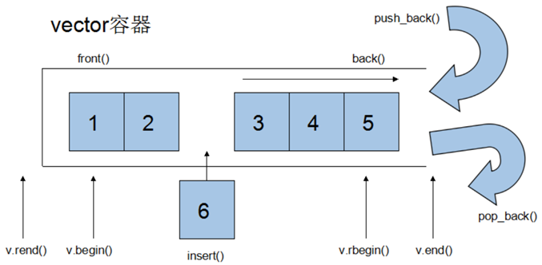
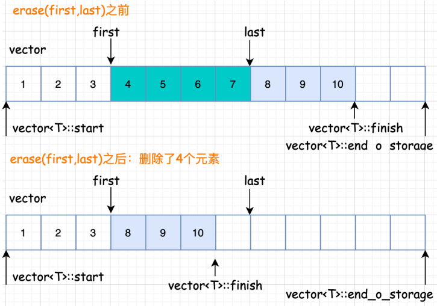
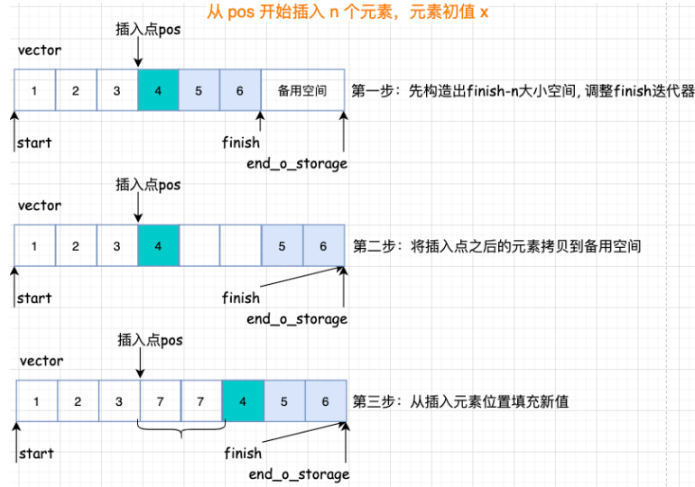
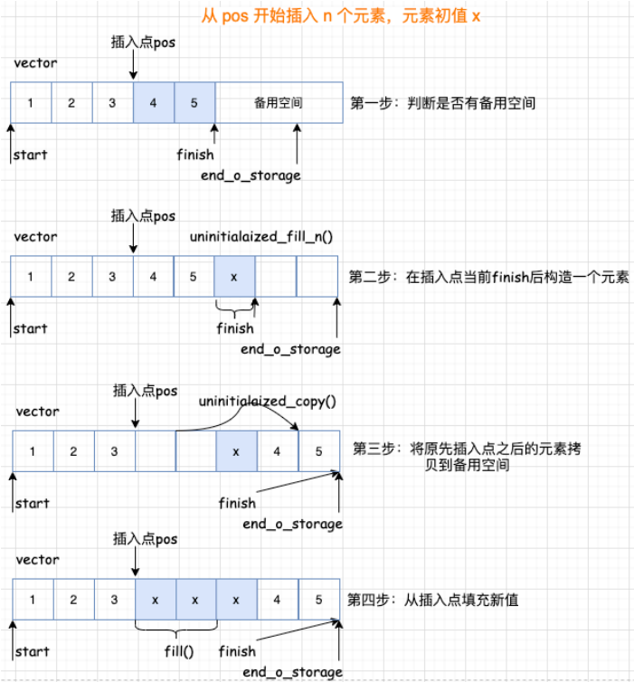
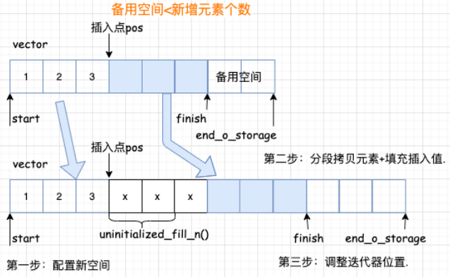

# 2.vector

# 1.基本概念

vector的数据安排以及操作方式，与array非常相似，两者的唯一差别在于**空间的运用的灵活性**。

Array是静态空间，一旦配置了就不能改变，要换大一点或者小一点的空间，可以，一切琐碎得由自己来，首先配置一块新的空间，然后将旧空间的数据搬往新空间，再释放原来的空间。

Vector是动态空间，随着元素的加入，它的内部机制会自动扩充空间以容纳新元素。因此vector的运用对于内存的合理利用与运用的灵活性有很大的帮助，再也不必害怕空间不足而一开始就要求一个大块头的array了。

Vector的实现技术，关键在于其对大小的控制以及重新配置时的数据移动效率，一旦vector旧空间满了，如果客户每新增一个元素，vector内部只是扩充一个元素的空间，实为不智，因为所谓的扩充空间(不论多大)，一如刚所说，是”配置新空间-数据移动-释放旧空间”的大工程,时间成本很高，应该加入某种未雨绸缪的考虑，稍后便可以看到vector的空间配置策略。



# 2.vector迭代器

Vector维护一个线性空间，所以不论元素的型别如何，普通指针都可以作为vector的迭代器，因为vector迭代器所需要的操作行为，如`operaroe*`, `operator->`, `operator++`, `operator–`, `operator+`, `operator-`, `operator+=`, `operator-=`, 普通指针天生具备。

Vector支持随机存取，而普通指针正有着这样的能力。所以vector提供的是随机访问迭代器(Random Access Iterators).

如：

```cpp
std::vector<int>::iterator it1;
std::vector<Teacher>::iterator it2;
```

`it1`的型别其实就是`int*`，`it2`的型别其实就是`Teacher*`.

# 3.vector的数据结构

Vector所采用的数据结构非常简单，线性连续空间，它以两个迭代器`_Myfirst`和`_Mylast`分别指向配置得来的连续空间中目前已被使用的范围，并以迭代器`_Myend`指向整块连续内存空间的尾端。

为了降低空间配置时的速度成本，vector实际配置的大小可能比客户端需求大一些，以备将来可能的扩充，这边是容量的概念。换句话说，一个vector的容量永远大于或等于其大小，一旦容量等于大小，便是满载，下次再有新增元素，整个vector容器就得另觅居所。

> 所谓动态增加大小，并不是在原空间之后续接新空间(因为无法保证原空间之后尚有可配置的空间)，而是一块更大的内存空间，然后将原数据拷贝新空间，并释放原空间。因此，**对vector的任何操作，一旦引起空间的重新配置，指向原vector的所有迭代器就都失效了。这是程序员容易犯的一个错误，务必小心**。

# 4.vector常用API操作

## 4.1 构造函数

```cpp
std::vector<T> v;     //采用模板实现类实现，默认构造函数
std::vector(v.begin(), v.end());  //将v[begin(), end())区间中的元素拷贝给本身。
std::vector(n, elem);  //构造函数将n个elem拷贝给本身。
std::vector(const vector &vec);  //拷贝构造函数。
```

demo：

```cpp
int arr[] = {2,3,4,1,9};
std::vector<int> v1(arr, arr + sizeof(arr) / sizeof(int)); 
```

## 4.2 常用赋值操作

```cpp
// 将[beg, end)区间中的数据拷贝赋值给本身。
assign(beg, end);
// 将n个elem拷贝赋值给本身。
assign(n, elem);
// 重载等号操作符
vector& operator=(const vector  &vec);
// 将vec与本身的元素互换。
swap(vec);
```

## 4.3 大小操作

```cpp
// 返回容器中元素的个数
size();
// 判断容器是否为空
empty();
//重新指定容器的长度为num，若容器变长，则以默认值填充新位置。如果容器变短，则末尾超出容器长度的元素被删除。
resize(int num);
//重新指定容器的长度为num，若容器变长，则以elem值填充新位置。如果容器变短，则末尾超出容器长度的元素被删除。
resize(int num, elem);
//容器的容量
capacity();
//容器预留len个元素长度，预留位置不初始化，元素不可访问。
reserve(int len);
```

## 4.4 数据存取操作

```cpp
//返回索引idx所指的数据，如果idx越界，抛出out_of_range异常。
at(int idx); 
//返回索引idx所指的数据，越界时，运行直接报错
operator[];
//返回容器中第一个数据元素
front();
//返回容器中最后一个数据元素
back();
```

## 4.5 插入和删除操作

```cpp
//迭代器指向位置pos插入count个元素ele.
insert(const_iterator pos, int count,ele);
//尾部插入元素ele
push_back(ele); 
//删除最后一个元素
pop_back();
//删除迭代器从start到end之间的元素
erase(const_iterator start, const_iterator end);
//删除迭代器指向的元素
erase(const_iterator pos);
//删除容器中所有元素
clear();
```

### （1）删除元素

删除范围内的元素，第⼀步要将 finish 迭代器后⾯的元素拷⻉回去，然后返回拷⻉完成的尾部迭代器，最后在删除之前的。

删除指定位置的元素就是实际就是将指定位置后⾯的所有元素向前移动, 最后析构掉最后⼀个元素。



### （2）插入元素

vector 的插⼊元素具体来说呢，⼜分三种情况：

- 如果备⽤空间⾜够且插⼊点的现有元素多于新增元素；



- 如果备⽤空间⾜够且插⼊点的现有元素⼩于新增元素；



- 如果备⽤空间不够



### （3）迭代器失效问题

通过图解就明⽩了，所谓的迭代器失效问题是**由于元素空间新配置导致之前的迭代器访问的元素不在了**，总结来说有两种：

- 由于插⼊元素，使得容器元素整体迁移导致存放原容器元素的空间不再有效，从⽽使得指向原空间的迭代器失效；
- 由于删除元素，使得某些元素次序发⽣变化导致原本指向某元素的迭代器不再指向期望指向的元素。

# 5.总结

## 5.1 优点

- 在内存中分配⼀块连续的内存空间进⾏存，可以像数组⼀样操作，动态扩容。
- 随机访问⽅便，⽀持下标访问和`vector.at()`操作。
- 节省空间。

## 5.2 缺点

- 由于其顺序存储的特性， vector 插⼊删除操作的时间复杂度是 O(n)。
- 只能在末端进⾏pop和push。
- 当动态⻓度超过默认分配⼤⼩后，要整体᯿新分配、拷⻉和释放空间。

vector的缺点也很明显, 在**频率较⾼的插⼊和删除时效率就太低**了

最后提醒需要注意的是： vector 的成员函数都不做边界检查 (at⽅法会抛异常)，使⽤者要⾃⼰确保迭代器和索引值的合法性。

# 6.demo

## 6.1 巧用swap，收缩内存空间

```cpp
std::vector<int> v;
for (int i = 9; i < 100000; i++) {
    v.push_back(i);
}

std::cout << "capacity:" << v.capacity() << std::endl;
std::cout << "size:" << v.size() << std::endl;

//此时 通过resize改变容器大小
v.resize(10);

std::cout << "capacity:" << v.capacity() << std::endl;
std::cout << "size:" << v.size() << std::endl;

// 容量没有变
std::vector<int>(v).swap(v);
std::cout << "capacity:" << v.capacity() << std::endl;
std::cout << "size:" << v.size() << std::endl;
```

运行结果：

```bash
capacity:138255
size:99991
capacity:138255
size:10
capacity:10
size:10
```

## 6.2 reserve预留空间

```cpp
std::vector<int> v;
//预先开辟空间
v.reserve(100000);

int* pStart = NULL;
int count = 0;
for (int i = 0; i < 100000; i++) {
    v.push_back(i);
    if (pStart != &v[0]) {
        pStart = &v[0];
        count++;
    }
}

std::cout << "count:" << count << std::endl;
std::cout << "capacity:" << v.capacity() << std::endl;
std::cout << "size:" << v.size() << std::endl;
```

运行结果：

```bash
count:1
capacity:100000
size:100000
```
