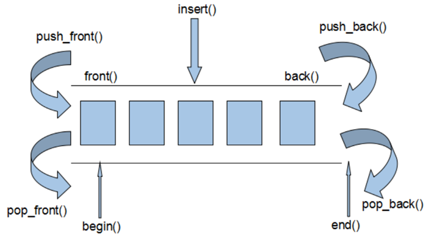
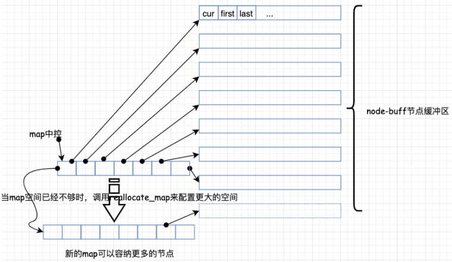
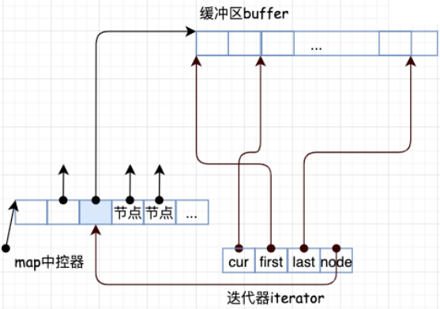
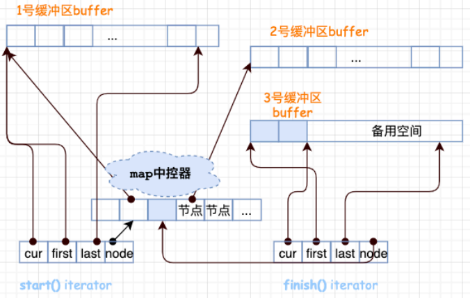

# 4.deque

# 1.基本概念

Vector容器是单向开口的连续内存空间，deque则是一种双向开口的连续线性空间。

所谓的双向开口，意思是可以在头尾两端分别做元素的插入和删除操作，当然，vector容器也可以在头尾两端插入元素，但是在其头部操作效率奇差，无法被接受。



deque容器和vector容器最大的差异

- 在于**deque允许使用常数项时间对头端进行元素的插入和删除操作**。
- 在于deque没有容量的概念，因为它是动态的以分段连续空间组合而成，随时可以增加一段新的空间并链接起来，换句话说，像vector那样，“旧空间不足而重新配置一块更大空间，然后复制元素，再释放旧空间”这样的事情在deque身上是不会发生的。也因此，deque没有必须要提供所谓的空间保留(reserve)功能.

虽然deque容器也提供了Random Access Iterator，但是它的迭代器并不是普通的指针，其复杂度和vector不是一个量级，这当然影响各个运算的层面。因此，除非有必要，应该尽可能的使用vector，而不是deque。对deque进行的排序操作，为了最高效率，可将deque先完整的复制到一个vector中，对vector容器进行排序，再复制回deque.

# 2.deque的中控器

**deque 在逻辑上看起来是连续空间，内部是由⼀段⼀段的定长连续空间构成**。

⼀旦有必要在 deque 的前端或尾端增加新空间，便配置⼀段定ᰁ的连续空间，串接在整个 deque 的头部或尾部。

设计 deque 的⼤师们，想必是让 deque 的最⼤挑战就是在这些分段的定量连续空间上，维护其整体连续的假象，并提供其随机存取的接口，从⽽避开了像 vector 那样的“重新配置-复制-释放”开销三部曲。这样⼀来，虽然开销降低，却提⾼了复杂的迭代器架构。

因此数据结构的设计和迭代器前进或后退等操作都⾮常复杂。

deque 采⽤⼀块所谓的 map （注意不是STL⾥⾯的map容器）作为中控器，其实就是⼀⼩块连续空间，其中的每个元素都是指针，指向另外⼀段较⼤的连续线性空间，称之为缓冲区。 在后⾯可以看到，缓冲区才是 deque 的储存空间主体。

其示例图如下： deque 的结构设计中， map 和 node-buffer 的关系如下：



# 3.deque的迭代器

deque 是分段连续空间，维持其“整体连续”假象的任务，就靠它的迭代器来实现，也就是 `operator++` 和`operator--` 两个运算⼦上⾯。

deque 的迭代器应该具备的结构和功能

- 第⼀点，既然是分段连续，迭代器应该能指出当前的连续空间在哪⾥；
- 第⼆点因为缓冲区有边界，迭代器还应该要能判断，当前是否处于所在缓冲区的边缘，如果是，⼀旦前进或后退，就必须跳转到下⼀个或上⼀个缓冲区；
- 第三点，也就是实现前⾯两种情况的前提，迭代器必须能随时控制中控器。

deque 的中控器、缓冲区、迭代器之间的相互关系 ：



deque 的每⼀个缓冲区由设计了三个迭代器：`cur`、`first`和`last`。

每⼀段都指向⼀个缓冲区 buffer，⽽缓冲区是需要知道每个元素的位置的，所以需要这些迭代器去访
问。

- `cur` 表示当前所指的位置；
- `first` 表示当前数组中头的位置；
- `last` 表示当前数组中尾的位置。

这样就⽅便管理，需要注意的是 deque 的空间是由 map 管理的， 它是⼀个指向指针的指针， 所以三个参数都是指向当前的数组，但这样的数组可能有多个，只是每个数组都管理这3个变量。

缓冲区的代销由一个全局函数决定。

假设现在构造了⼀个 int 类型的 deque，设置缓冲区⼤⼩等于 32，这样⼀来，每个缓冲区可以容纳
`32/sizeof(int) = 8`（ 64位系统） 个元素。经过⼀番操作之后， deque 现在有 20 个元素了，那么成员函数 begin()和 end() 返回的两个迭代器应该是怎样的呢？如下图所示：



20 个元素需要 `20/(sizeof(int)) = 5`（图中只展示3个） 个缓冲区。所以 map 运⽤了三个节点。迭代器 start 内的cur 指针指向缓冲区的第⼀个元素，迭代器 finish 内的 cur 指针指向缓冲区的最后⼀个元素(的下⼀个位置)。

注意，最后⼀个缓冲区尚有备⽤空间，如果之后还有新元素插⼊，则直接插⼊到备⽤空间。

# 4.deque常用API

## 4.1 构造函数

```cpp
// 默认构造形式
std::deque<T> deq;
// 构造函数将[beg, end)区间中的元素拷贝给本身。
std::deque(beg, end);
// 构造函数将n个elem拷贝给本身。
std::deque(n, elem);
// 拷贝构造函数
std::deque(const deque &deq);
```

## 4.2 赋值操作

```cpp
// 将[beg, end)区间中的数据拷贝赋值给本身。
assign(beg, end);
// 将n个elem拷贝赋值给本身。
assign(n, elem);
// 重载等号操作符 
deque& operator=(const deque &deq); 
// 将deq与本身的元素互换
swap(deq);
```

## 4.3 大小操作

```cpp
// 返回容器中元素的个数
size();
// 判断容器是否为空
empty();
// 重新指定容器的长度为num,若容器变长，则以默认值填充新位置;
// 如果容器变短，则末尾超出容器长度的元素被删除。
resize(num);
// 重新指定容器的长度为num,若容器变长，则以elem值填充新位置;
// 如果容器变短，则末尾超出容器长度的元素被删除。
resize(num, elem); 
```

## 4.4 数据存取

```cpp
// 返回索引idx所指的数据，如果idx越界，抛出out_of_range。
at(idx);
// 返回索引idx所指的数据，如果idx越界，不抛出异常，直接出错。
operator[];
// 返回第一个数据。
front();
// 返回最后一个数据
back();
```

## 4.5 双端插入和删除

```cpp
// 在容器尾部添加一个数据
push_back(elem);
// 在容器头部插入一个数据
push_front(elem);
// 删除容器最后一个数据
pop_back();
// 删除容器第一个数据
pop_front();
```

## 4.6 插入操作

```cpp
// 在pos位置插入一个elem元素的拷贝，返回新数据的位置。
insert(pos, elem);
// 在pos位置插入n个elem数据，无返回值。
insert(pos, n, elem);
// 在pos位置插入[beg,end)区间的数据，无返回值。
insert(pos, beg, end);
```

## 4.7 **删除操作**

```cpp
// 移除容器的所有数据
clear();
// 删除[beg,end)区间的数据，返回下一个数据的位置。
erase(beg,end);
// 删除pos位置的数据，返回下一个数据的位置。
erase(pos);
```

# 5.总结

deque 其实是在功能上合并了 vector 和 list。

## 5.1 优点：

- 随机访问⽅便，即⽀持 \[ ] 操作符和 `vector.at()`；
- 在内部⽅便的进⾏插⼊和删除操作；
- 可在两端进⾏ push、 pop

## 5.2 缺点

- 因为涉及⽐较复杂，采⽤分段连续空间，所以占⽤内存相对多。

## 5.3 使⽤区别：

1. 如果需要⾼效的随即存取，⽽不在乎插⼊和删除的效率，使⽤ vector。
2. 如果你需要大量的插⼊和删除，⽽不关⼼随机存取，则应使⽤ list。
3. 如果你需要随机存取，⽽且关⼼两端数据的插⼊和删除，则应使⽤ deque 。
