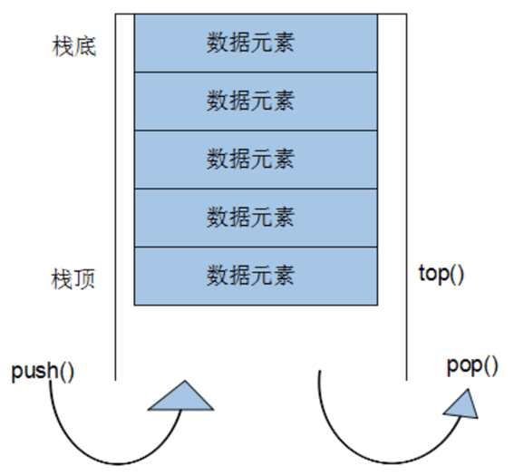
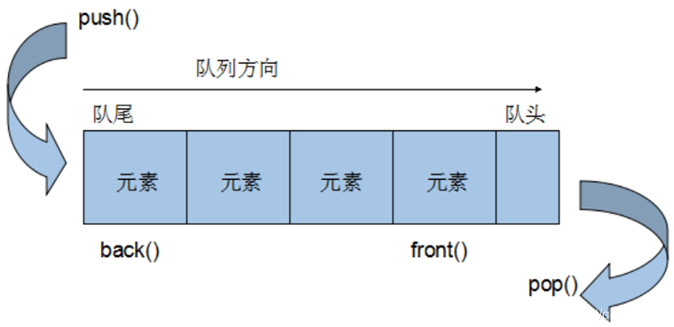

# 5.以deque为底层的容器适配器

# 1.Stack

## 1.1 基本概念

stack是一种先进后出(First In Last Out,FILO)的数据结构，它只有一个出口，形式如图所示。stack容器允许新增元素，移除元素，取得栈顶元素，但是除了最顶端外，没有任何其他方法可以存取stack的其他元素。换言之，stack不允许有遍历行为。

有元素推入栈的操作称为: `push`，将元素推出stack的操作称为`pop`.



## 1.2 stack没有迭代器

Stack所有元素的进出都必须符合“先进后出”的条件，只有stack顶端的元素，才有机会被外界取用。Stack不提供遍历功能，也不提供迭代器。

## 1.3 常用API

### （1）构造函数

```cpp
// stack采用模板类实现， stack对象的默认构造形式： 
std::stack<T> stkT;
// 拷贝构造函数
std::stack(const stack &stk);
```

### （2）赋值操作

```cpp
// 重载等号操作符
std::stack& operator=(const stack &stk);
```

### （3）数据存取操作

```cpp
// 向栈顶添加元素
push(elem);
// 从栈顶移除第一个元素
pop();
// 返回栈顶元素
top();
```

### （4）大小操作

```cpp
// 判断堆栈是否为空
empty();
// 返回堆栈的大小
size();
```

# 2.queue容器

## 2.1 基本概念

queue是一种先进先出(First In First Out,FIFO)的数据结构，它有两个出口，queue容器允许从一端新增元素，从另一端移除元素



## 2.2 queue没有迭代器

Queue所有元素的进出都必须符合“先进先出”的条件，只有queue的顶端元素，才有机会被外界取用。Queue不提供遍历功能，也不提供迭代器。

## 2.3 常用API

### （1）构造函数

```cpp
// queue采用模板类实现，queue对象的默认构造形式：
std::queue<T> queT;
// 拷贝构造函数
std::queue(const queue &que);
```

### （2）存取、插入和删除操作

```cpp
// 往队尾添加元素
push(elem);
// 从队头移除第一个元素
pop();
// 返回最后一个元素
back();
// 返回第一个元素
front();
```

### （3）赋值操作

```cpp
// 重载等号操作符
queue& operator=(const queue &que);
```

### （4）大小操作

```cpp
// 判断队列是否为空
empty();
// 返回队列的大小
size();
```

# 3.priority\_queue

## 3.1 基本概念

priority\_queue 又称为优先队列，其底层是用堆来进行实现的。

在优先队列中，队首元素一定是当前队列中优先级最高的那一个。

可以在任何时候往优先队列里面加入 (push) 元素，而优先队列底层的数据结构堆 (heap) 会随时调整结构，使得每次的队首元素都是优先级最大的。

## 3.2 常用API

### （1）元素访问

和队列不一样的是，优先队列没有 `front()` 函数与 `back()` 函数，而只能通过 `top()` 函数来访问队首元素（也可以称为堆顶元素），也就是优先级最高的元素。

### （2）存取

```cpp
// 往队尾添加元素
push(elem);
// 获得队首元素（即堆顶元素）
top();
// 从队头移除第一个元素
pop();
```

### （3）大小操作

```cpp
// 判断队列是否为空
empty();
// 返回队列的大小
size();
```

## 3.3 优先级设置

### （1）基本数据类型

此处指的基本数据类型就是 int 型、double 型、char 型等可以直接使用的数据类型，**优先队列对它们的优先级设置一般是数字大的优先级越高**，因此队首元素就是优先队列内元素最大的那个（如果 char 型，则是字典序最大的）。

对基本数据类型来说，下面两种优先队列的定义是等价的（以 int 型为例，注意最后两个 > 之间有一个空格）：

```cpp
priority_queue<int> q;
priority_queue<int,vector<int>,less<int>> q;
```

可以发现，第二种定义方式的尖括号内多出了两个参数：一个是 `vector<int>`，另一个是 `less<int>`。

- &#x20;`vector<int>`（也就是第二个参数）填写的是来承载底层数据结构堆（heap）的容器，如果第一个参数是 double 型或 char 型，则此处只需要填写 `vector<double>` 或 `vector<char>`；
- `less<int>` 则是对第一个参数的比较类，`less<int>` 表示数字大的优先级越大，而 `greater<int>` 表示数字小的优先级越大。

如果想让优先队列总是把最小的元素放在队首，只需进行如下定义：

```cpp
priority_queue<int,vector<int>,greater<int>>q;
```

### （2）自定义数据类型

可以对水果的名称和价格建立一个结构体，如下所示：

```cpp
struct fruit{
    string name;
    int price;
};
```

现在希望按水果的价格高的为优先级高，就需要重载（overload）小于号"<"。

```cpp
struct fruit 
{
    string name;int price;
    friend bool operator <(fruit f1,fruit f2)
    {
        return f1.price < f2.price;
    }
};
```

函数内部为 `return fl.price<f2.price` ，因此重载后小于号还是小于号的作用。

此时就可以直接定义`fruit`类型的优先队列，其内部就是以价格高的水果为优先级高，如下所示：

```cpp
priority_queue<fruit>q;

```

示例：

```cpp
int main()
{
    priority_queue<fruit> q;
    f1.name = "桃子";
    f1.price = 3;
    f2.name = "梨子";
    f2.price = 4;
    f3.name = "苹果";
    f3.price= 1;
    q.push(f1l);
    q.push (f2);
    q.push(f3);
    // 苹果 1
    cout<< q.top().name <<""<<q.top().price << endl;
    return 0;
}
```

此处对小于号的重载与排序函数 `sort `中的 `cmp `函数有些相似，它们的参数都是两个变量，函数内部都是 return 了true 或者 false。

事实上，这两者的作用确实是类似的，只不过效果看上去似乎是 "相反" 的。

**在排序中，如果是 ****`return fl.price > f2.price`**** ，那么则是按价格从高到低排序，但是在优先队列中却是把价格低的放到队首**。

原因在于，优先队列本身默认的规则就是优先级高的放在队首，因此把小于号重载为大于号的功能时只是把这个规则反向了一下。

那么，有没有办法跟 sort 中的 cmp 函数那样写在结构体外面呢？

自然是有办法的。只需要把 friend 去掉，把小于号改成一对小括号，然后把重载的函数写在结构体外面，同时将其用struct包装起来，如下所示，注意对比：

```cpp
struct cmp
{
    bool operator ()(fruit f1,fruit f2)
    {
        return f1.price > f2.price;
    }
};
```

在这种情况下，需要用之前讲解的第二种定义方式来定义优先队列：

```cpp
priority_queue<fruit,vector<fruit>,cmp>q;
```

可以看到，此处只是把 greater部分换成了 cmp。

示例如下：

```cpp
#include <iostream>
#include<string>
#include <queue>
using namespace std;
struct fruit {
    string name;int price;
}f1,f2,f3;
struct cmp {
    bool operator ()(fruit fl,fruit f2)
    {
        return f1.price >f2.price;
    }
};
int main()
{
    priority_queue<fruit,vector<fruit>,cmp> q;
    f1.name = "桃子";
    f1.price = 3;
    f2.name ="梨子";
    f2.price = 4;
    f3.name="苹果";
    f3.price = 1;
    q.push (f1);
    q.push(f2);
    q.push(f3);
    cout<<q.top().name <<"" <<q.top().price <<endl;
    return 0;
}
```
