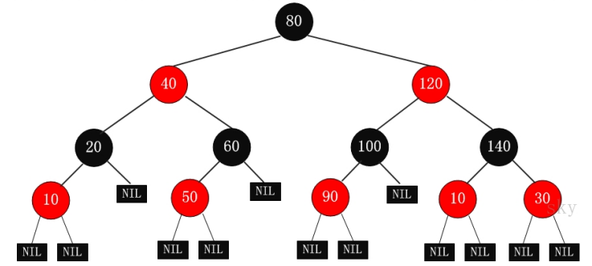
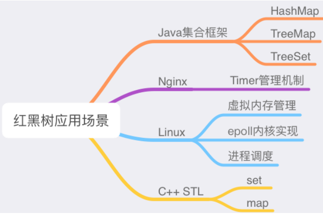

# 6.红黑树

RB Tree 全称是 Red-Black Tree，⼜称为“红⿊树”，它⼀种特殊的⼆叉查找树。红⿊树的每个节点上都有存储位表示节点的颜⾊，可以是红 (Red) 或⿊ (Black)。

红⿊树的特性:

- 每个节点或者是⿊⾊，或者是红⾊。
- 根节点是⿊⾊。
- 每个叶⼦节点（ NIL）是⿊⾊。 \[注意：这⾥叶⼦节点，是指为空(NIL或NULL)的叶⼦节点！ ]
- 如果⼀个节点是红⾊的，则它的⼦节点必须是⿊⾊的。
- 从⼀个节点到该节点的⼦孙节点的所有路径上包含相同数⽬的⿊节点。

注意：

- 特性 (3)中的叶⼦节点，是只为空(NIL或null)的节点。
- 特性 (5)确保没有⼀条路径会⽐其他路径⻓出俩倍。因⽽，红⿊树是相对是接近衡的⼆叉树。

红⿊树示意图如下：

红⿊树保证了最坏情形下在 `O(logn)` 时间复杂度内完成查找、插⼊及删除操作；效率⾮常之⾼。

因此红⿊树可⽤于很多场景，⽐如下图。

