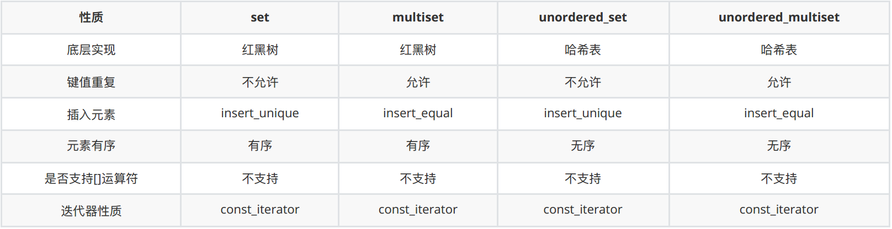

# 8.set

# 1.set

## 1.1 基本概念

- set 以 RB-tree 作为其底层机制，所有元素都会根据元素的键值⾃动被排序。
- set 的元素就是键值，**set 不允许两个元素有相同的键值**。
- **不允许通过 set 的迭代器来改变 set 的元素值**，因为 set 的元素值就是键值，更改了元素值就会影响其排列规则，如果任意更改元素值，会严重破坏 set 组织，因此在定义 set 的迭代器时被定义成了 RB-tree 的const\_iterator。
- 由于 set 不允许有两个相同的键值，所以插⼊时采⽤的是 RB-tree 的 insert\_unique ⽅式
- 这⾥的类型的定义要注意⼀点, 都是 const 类型, 因为 set 的主键定义后就不能被修改了, 所以这⾥都是以const类型。

## 1.2 常用API

### （1）构造函数

```cpp
// set默认构造函数：
std::set<T> st;
// multiset默认构造函数: 
std::mulitset<T> mst; 
// 拷贝构造函数
std::set(const set &st);
```

### （2）赋值操作

```cpp
// 重载等号操作符
set& operator=(const set &st);
// 交换两个集合容器
swap(st);
```

### （3）大小操作

```cpp
// 返回容器中元素的数目
size();
// 判断容器是否为空
empty();
```

### （4）插入和删除操作

```cpp
// 在容器中插入元素。
insert(elem);
// 清除所有元素
clear();
// 删除pos迭代器所指的元素，返回下一个元素的迭代器。
erase(pos);
// 删除区间[beg,end)的所有元素 ，返回下一个元素的迭代器。
erase(beg, end);
// 删除容器中值为elem的元素。
erase(elem);
```

### （5）查找操作

```cpp
// 查找键key是否存在,若存在，返回该键的元素的迭代器；若不存在，返回set.end();
find(key);
// 查找键key的元素个数
count(key);
// 返回第一个key>=keyElem元素的迭代器。
lower_bound(keyElem);
// 返回第一个key>keyElem元素的迭代器。
upper_bound(keyElem);
// 返回容器中key与keyElem相等的上下限的两个迭代器。
equal_range(keyElem);
```

# 2.multiset

multiset 与 set 特性完全相同，**唯⼀差别在于它允许键值重复**，因此插⼊操作采⽤的是底层机制 RB-tree 的insert\_equal() ⽽⾮ insert\_unique()。

# 3.hash\_set 与 unordered\_set

它们都属于基于哈希表(hash table)构建的数据结构，并且是关键字与键值相等的关联容器。

那 hash\_set 与 unordered\_set 哪个更好呢？ 实际上 unordered\_set 在C++11的时候被引⼊标准库了，⽽hash\_set 并没有，所以建议还是使⽤ unordered\_set ⽐较好，这就好⽐⼀个是官⽅认证的，⼀个是⺠流传的。

在 SGI STL 源码剖析⾥，是以 hash\_set 剖析的。

hash\_set 将哈希表的接口在进⾏了⼀次封装, 实现与 set 类似的功能.

# 4.总结


