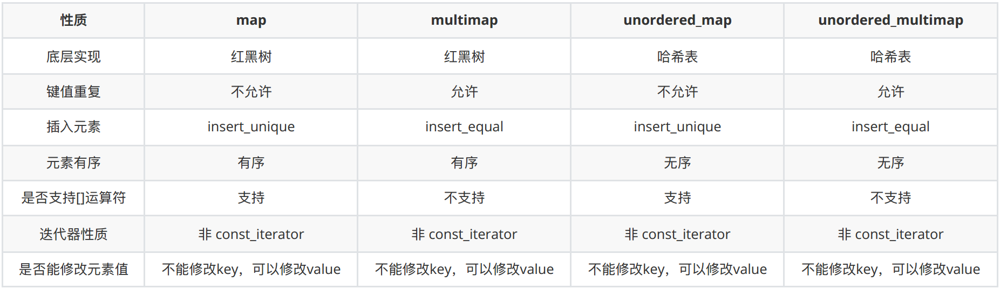

# 9.map

# 1.pair

对组(pair)将一对值组合成一个值，这一对值可以具有不同的数据类型，两个值可以分别用pair的两个公有属性first和second访问。

pair 是⼀个有两个变量的结构体, 即谁都可以直接调⽤它的变量, 毕竟 struct 默认权限都是 public, 将两个变量⽤pair 绑定在⼀起, 这就为 `map<T1, T2>` 提供的存储的基础.

```cpp
template <class T1, class T2> // 两个参数类型
struct pair {
    typedef T1 first_type;
    typedef T2 second_type;
    // 定义的两个变量
    T1 first;
    T2 second;
    // 构造函数
    pair() : first(T1()), second(T2()) {}
    pair(const T1& a, const T2& b) : first(a), second(b) {}
#ifdef __STL_MEMBER_TEMPLATES
    template <class U1, class U2>
    pair(const pair<U1, U2>& p) : first(p.first), second(p.second) {}
#endif
};
```

创建对组

```cpp
//第一种方法创建一个对组
std::pair<string, int> pair1(string("name"), 20);
std::cout << pair1.first << std::endl; //访问pair第一个值
std::cout << pair1.second << std::endl;//访问pair第二个值
//第二种
std::pair<string, int> pair2 = make_pair("name", 30);
std::cout << pair2.first << std::endl;
std::cout << pair2.second << std::endl;
//pair=赋值
std::pair<string, int> pair3 = std::pair2;
std::cout << pair3.first << std::endl;
std::cout << pair3.second << std::endl;
```

# 2.map/multimap

## 2.1 基本概念

`Map`的特性是，所有元素都**会根据元素的键值自动排序**。

`Map`所有的元素都是`pair`，同时拥有实值和键值，\*\*`pair`\*\***的第一元素被视为键值，第二元素被视为实值**，`map`不允许两个元素有相同的键值。

不可以通过map的迭代器改变map的键值, 因为map的键值关系到map元素的排列规则，任意改变map键值将会严重破坏map组织。如果想要修改元素的实值，那么是可以的。

Map和list拥有相同的某些性质，当对它的容器元素进行新增操作或者删除操作时，操作之前的所有迭代器，在操作完成之后依然有效，当然被删除的那个元素的迭代器必然是个例外。

Multimap和map的操作类似，唯一区别multimap键值可重复。

**Map和multimap都是以红黑树为底层实现机制**。

## 2.2 常用API

### （1）构造函数

```cpp
// map默认构造函数: 
std::map<T1, T2> mapTT;
// 拷贝构造函数
std::map(const map &mp);
```

### （2）赋值操作

```cpp
// 重载等号操作符
std::map& operator=(const map &mp);
// 交换两个集合容器
swap(mp);
```

### （3）大小操作

```cpp
// 返回容器中元素的数目
size();
// 判断容器是否为空
empty();
```

### （4）插入数据

```cpp
// 往容器插入元素，返回pair<iterator,bool>
map.insert(...); 
```

```cpp
map<int, string> mapStu;
// 第一种 通过pair的方式插入对象
mapStu.insert(pair<int, string>(3, "小张"));
// 第二种 通过pair的方式插入对象
mapStu.inset(make_pair(-1, "校长"));
// 第三种 通过value_type的方式插入对象
mapStu.insert(map<int, string>::value_type(1, "小李"));
// 第四种 通过数组的方式插入值
mapStu[3] = "小刘";
mapStu[5] = "小王";
```

### （5）删除操作

```cpp
// 删除所有元素
clear();
// 删除pos迭代器所指的元素，返回下一个元素的迭代器。
erase(pos);
// 删除区间[beg,end)的所有元素 ，返回下一个元素的迭代器。
erase(beg,end);
// 删除容器中key为keyElem的对组。
erase(keyElem);
```

### （6）查找操作

```cpp
// 查找键key是否存在,若存在，返回该键的元素的迭代器；
// 若不存在，返回map.end();
find(key);
// 返回容器中key为keyElem的对组个数。
// 对map来说，要么是0，要么是1。对multimap来说，值可能大于1。
count(keyElem);
// 返回第一个key>=keyElem元素的迭代器。
lower_bound(keyElem);
// 返回第一个key>keyElem元素的迭代器。
upper_bound(keyElem);
// 返回容器中key与keyElem相等的上下限的两个迭代器。
equal_range(keyElem);
```

`find` 示例

```cpp
#include <iostream>
#include <map>

int main ()
{
  std::map<char,int> mymap;
  std::map<char,int>::iterator it;

  mymap['a']=50;
  mymap['b']=100;
  mymap['c']=150;
  mymap['d']=200;

  it = mymap.find('b');
  if (it != mymap.end())
    mymap.erase (it);

  // print content:
  std::cout << "elements in mymap:" << '\n';
  std::cout << "a => " << mymap.find('a')->second << '\n';
  std::cout << "c => " << mymap.find('c')->second << '\n';
  std::cout << "d => " << mymap.find('d')->second << '\n';


  return 0;
}
```

`count` 示例

```cpp
#include <iostream>
#include <map>

int main ()
{
  std::map<char,int> mymap;
  char c;

  mymap ['a']=101;
  mymap ['c']=202;
  mymap ['f']=303;

  for (c='a'; c<'h'; c++)
  {
    std::cout << c;
    if (mymap.count(c)>0)
      std::cout << " is an element of mymap.\n";
    else 
      std::cout << " is not an element of mymap.\n";
  }

  return 0;
}
```

# 3.总结

## 3.1 map 和 multimap

### （1）共同点

- 两者底层实现均为红⿊树，不可以通过迭代器修改元素的键，但是可以修改元素的值；
- 拥有和 list 某些相同的特性，进⾏元素的新增和删除后，操做前的迭代器依然可⽤；

### （2）不同点

- map 键不能重复，⽀持 `[]` 运算符；
- multimap ⽀持重复的键，不⽀持 `[]` 运算符；

map 并不像 set ⼀样将 iterator 设为 RB-tree 的 const\_iterator，因为它允许⽤户通过其迭代器修改元素的实值。

## 3.2 map 和 unordered\_map

### （1）共同点：

- 两者均不能有重复的建，均⽀持`[]`运算符

### （2）不同点：

- map 底层实现为红⿊树
- unordered\_map 底层实现为哈希表

unordered\_map 是不允许存在相同的键存在，底层调⽤的 `insert_unique()` 插⼊元素

unordered\_multimap 可以允许存在多个相同的键，底层调⽤的 `insert_equal()` 插⼊元素

map 并不像 set ⼀样将 iterator 设为 RB-tree 的 const\_iterator，因为它允许⽤户通过其迭代器修改元素的实值


