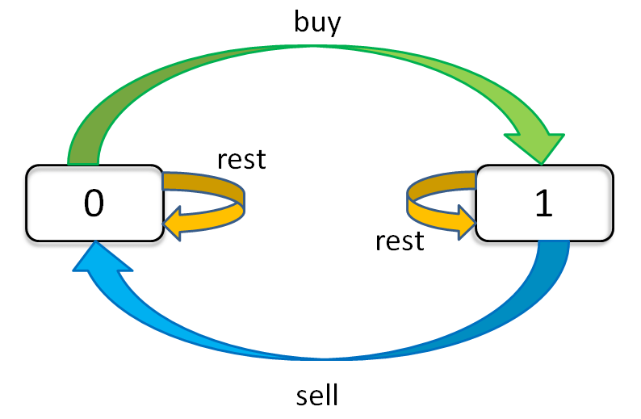
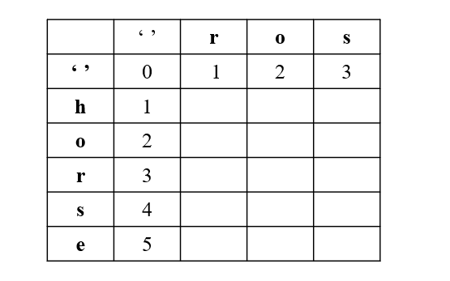

# 19.高级动态规划

# 1.动态规划

## 1.1 递归 & 分治

递归：函数自己调用自己

```python
def recursion(level, param1, param2, ...):
  # 1.recursion terminator (递归终止条件)
  if level > MAX_LeVEL:
    process_result
    return

  # 2.process logic in current level (处理当前层逻辑)
  process(level, data, ...)
  
  # 3.drill down (下探到下一层)
  self.recursion(level + 1, p1, ...)
  
  # 4.reverse the current level status if needed (清理当前层)
```

分治：

```python
def divide_conquer(problem, param1, param2, ...):
  # 1.recursion terminator (递归终止条件)
  if problem is None:
    print_result
    return
  
  # 2.prepare data (拆分问题)
  data = prepare_data(problem)
  subproblems = split_problem(problem, data)
  
  # 3.conquer subproblems (调子问题的递归函数)
  subresult1 = self.divide_conquer(subproblems[0], p1, ...)
  subresult1 = self.divide_conquer(subproblems[0], p1, ...)
  subresult1 = self.divide_conquer(subproblems[0], p1, ...)
  ...
  
  # 4.process and generate the final result (合并结果)
  result = process_result(subresult1, subresult2, subresult3, ...)
  
  # 5.revert the current level status (回复当前层状态)
```

## 1.2 动态规划 Dynamic Programming

1.  "Simplifying a complicated problem by breaking it down into simpler sub-problems" (int a recursive manner)
2.  Divide & Conquer + Optimal substructure (分治 + 最优子结构)
3.  顺推形式：动态递推

DP顺推模板

```python
function DP:
  # 二维情况
  dp = [][]
  
  for i = 0 ... M {
    for j in 0 ... N {
      dp[i][j] = _Fuction(dp[i'][j'] ...)
    }
  }
  
  return dp[M][N]

```

难点：

-   DP状态的定义：需要经验，现实问题定义为数组，有可能是一维、二维或三维；
-   状态转移方程怎么写：最简单情况：$ dp[i] = dp[i-1] + dp[i-2]  $；更多情况需要求最小值或者累加累减；从k个状态中找到它的最值

## 1.3 关键点

动态规划 和 递归或者分治 没有根本上的区别（关键看有无最优子结构）

**拥有共性：** ​**找到重复子问题**

**差异性：** ​**最优子结构、中途可以淘汰次优解**

# 2.状态转移方程

## 2.1 爬楼梯问题

[70. 爬楼梯 - 力扣（LeetCode）](https://leetcode.cn/problems/climbing-stairs/description/ "70. 爬楼梯 - 力扣（LeetCode）")

递推公式：$f(n) = f(n-1) + f(n-2), f(1)=1,f(0)=0$

递归：`O(2^n)`

```python
def f(n):
  if n <= 1:
    return 1
  return f(n - 1) + f(n - 2)

```

递归 + 记忆化搜索：`O(n)`

```python
def f(n):
  if n <= 1:
    return 1
  if n not in mem:
    mem[n] = f(n - 1) + f(n - 2)
  return mem[n]
```

动态规划：`O(n)`

```python
def f(n):
  dp = [1] * (n + 1)
  for i in range(2, n + 1):
    dp[i] = dp[i - 1] + dp[i - 2]
  return dp[n]
```

动态规划 + 内存优化：`O(n), O(1)`

```python
def f(n):
  x, y = 1, 1
  for i in range(1, n):
    y, x = x + y, y
  return y

```

## 2.2 不同路径

[62. 不同路径 - 力扣（LeetCode）](https://leetcode.cn/problems/unique-paths/description/ "62. 不同路径 - 力扣（LeetCode）")


递归公式：$f(x, y) = f(x - 1, y) + f(x, y - 1)$

递归：`O(mn), O(mn)`

```python
def f(x, y):
  if x <= 0 or y <= 0:
    return 0
  if x == 1 and y == 1:
    return 1
  return f(x - 1, y) + f(x, y - 1)
```

递归 + 记忆化搜索：`O(mn), O(mn)`

```python
def f(x, y):
  if x <= 0 or y <= 0:
    return 0
  if x == 1 and y == 1:
    return 1
  if (x, y) not in mem:
    mem[(x, y)] = f(x - 1, y) + f(x, y - 1)
  return mem[(x, y)]
```

动态规划：`O(mn), O(mn)`

```python
def f(x, y):
  dp = [[0] * (m + 1) for _ in range(n + 1)]
  dp[1][1] = 1
  for i in range(1, y + 1):
    for j in range(1, x + 1):
      dp[i][j] = dp[i - 1][j] + dp[j][i - 1]
      
  return dp[y][x]

```

## 2.3 打家劫舍

[198. 打家劫舍 - 力扣（LeetCode）](https://leetcode.cn/problems/house-robber/description/ "198. 打家劫舍 - 力扣（LeetCode）")

定义方式1：

-   `dp[i]`状态的定义：max \$ of robbing `A[0 → i]`
-   $dp[i] = max(dp[i - 2] + nums, dp[i - 1])$

定义方式2：

-   `dp[i][0]`状态定义：max \$ of robbing `A[0 → i]` 且没偷 `nums[i]`
-   `dp[i][1]`状态定义：max \$ of robbing `A[0 → i]` 且偷了 `nums[i]`
-   $dp[i][0] = max(dp[i - 1][0], dp[i - 1][1])$
-   $dp[i][1] = dp[i - 1][0] + nums[i]$&#x20;

## 2.4 最小路径和

[64. 最小路径和 - 力扣（LeetCode）](https://leetcode.cn/problems/minimum-path-sum/description/ "64. 最小路径和 - 力扣（LeetCode）")

`dp[i][j]`的状态定义：`minPath(A[1→i][1→j])`

$dp[i][j] = min(dp[i - 1][j], dp[i][j - 1] + A[i][j])$

## 2.5 买卖股票的最佳时机

[121. 买卖股票的最佳时机 - 力扣（LeetCode）](https://leetcode.cn/problems/best-time-to-buy-and-sell-stock/description/ "121. 买卖股票的最佳时机 - 力扣（LeetCode）")

[121. 买卖股票的最佳时机 - 力扣（LeetCode）](https://leetcode.cn/problems/best-time-to-buy-and-sell-stock/solutions/8753/yi-ge-fang-fa-tuan-mie-6-dao-gu-piao-wen-ti-by-l-3/ "121. 买卖股票的最佳时机 - 力扣（LeetCode）")



状态定义：`dp[i][k][0 or 1]` (0 ≤ i ≤ n - 1, i ≤ k ≤ K)

-   `i`为天数
-   `k`为最多交易次数
-   `[0, 1]`为是否持有股票
-   总状态数： `n*K*2`中状态

```python
for 0 <= i < n:
  for 1 <= k <= K:
    for s in {0, 1}:
      dp[i][k][s] = max(buy, sell, rest)

```

$dp[i][k][0] = max(dp[i - 1][k][0], dp[i - 1][k][1] + prices[i])$

-   `dp[i - 1][k][0]` : 选择 rest
-   `dp[i - 1][k][1] + prices[i]` ： 选择sell
-   今天没有持有股票，有两种可能：
    1.  昨天就没有持有股票，然后今天选择rest，多以今天还是没有持有股票
    2.  昨天持有股票，但是今天sell了，所以今天没有持有股票

$dp[i][k][1] = max(dp[i - 1][k][1], dp[i - 1][k - 1][0] - prices[i])$

-   `dp[i - 1][k][1]` : 选择rest
-   `dp[i - 1][k - 1][0] - prices[i]` : 选择buy
-   今天持有股票，有两种可能：
    1.  昨天就持有股票，但是今天选择rest，所以今天还持有股票
    2.  昨天本没有持有股票，但今天选择buy，所以今天持有股票

初始状态：

-   $dp[-1][k][0] = dp[i][0][0] = 0$
-   $dp[-1][k][1] = dp[i][0][1] = -infinity$

状态转移方程：

-   $dp[i][k][0] = max(dp[i - 1][k][0], dp[i - 1][k][1] + prices[i])$
-   $dp[i][k][1] = max(dp[i - 1][k][1], dp[i - 1][k - 1][0] - prices[i])$

# 3.进阶DP习题

复杂度来源：

1.  **状态拥有更多维度**（二维、三维、或者跟过、甚至需要压缩）
2.  **状态方程更加复杂**

## 3.1 最小花费爬楼梯

[746. 使用最小花费爬楼梯 - 力扣（LeetCode）](https://leetcode.cn/problems/min-cost-climbing-stairs/description/ "746. 使用最小花费爬楼梯 - 力扣（LeetCode）")

```bash
给你一个整数数组 cost ，其中 cost[i] 是从楼梯第 i 个台阶向上爬需要支付的费用。一旦你支付此费用，即可选择向上爬一个或者两个台阶。

你可以选择从下标为 0 或下标为 1 的台阶开始爬楼梯。

请你计算并返回达到楼梯顶部的最低花费。
```

```cpp
class Solution {
public:
    int minCostClimbingStairs(vector<int>& cost) {
        int n = cost.size();
        if (n < 2) {
            return 0;
        }

        std::vector<int> dp(n + 1);
        dp[0] = 0;
        dp[1] = 0;

        for (int i = 2; i <= n; i++) {
            dp[i] = std::min(dp[i - 1] + cost[i - 1], dp[i - 2] + cost[i - 2]);
        }

        return dp[n];
    }
};
```

## 3.2 编辑距离

[72. 编辑距离 - 力扣（LeetCode）](https://leetcode.cn/problems/edit-distance/description/ "72. 编辑距离 - 力扣（LeetCode）")

```bash
给你两个单词 word1 和 word2， 请返回将 word1 转换成 word2 所使用的最少操作数  。

你可以对一个单词进行如下三种操作：

- 插入一个字符
- 删除一个字符
- 替换一个字符
```

1.  BFS + 剪枝（单词的长度范围）
2.  DP
    1.  状态定义：`dp[0..i][0..j]`， i表示第一个字符串匹配到第二个字符串的长度；j表示第二个字符串匹配到第一个字符串的长度；`word1.substr(0, i)` 与 `word2.substr(0, j)`之间的编辑距离
    2.

**w1和w2的最后一个字符一样**

> w1 : ...x (i)
> w2 : ...x (j)&#x20;

`edit_dist(w1, w2) = edit_dist(w1[0 : i -1], w2[0, j - 1])`

`edit_dist(i, j) = edit_dist(i - 1, j - 1)`

**w1和w2的最后一个字符不一样**

> w1 : ...x (i)
> w2 : ...y (j)&#x20;

`edit_dist(i, j) = ``min``(edit_dist(i - 1, j - 1) + 1 , edit_dist(i - 1, j ) + 1, edit_dist(i, j - 1) + 1)`

-   `edit_dist(i - 1, j - 1) + 1` :  替换，编辑距离 + 1
-   `edit_dist(i - 1, j) + 1` : 删除word1最后一个字符， 编辑距离 + 1
-   `edit_dist(i , j - 1) + 1` : 删除 word2最后一个字符，编辑距离 + 1

注意，针对第一行，第一列要单独考虑，我们引入 `''` 下图所示：



第一行，是 `word1` 为空变成 `word2` 最少步数，就是插入操作

第一列，是 `word2` 为空，需要的最少步数，就是删除操作

```cpp
class Solution {
public:
    int minDistance(string word1, string word2) {
        int n1 = word1.size();
        int n2 = word2.size();
        std::vector<std::vector<int>> dp(n1 + 1, std::vector<int>(n2 + 1, 0));

        // 第一行
        for (int j = 1; j <= n2; j++) {
            dp[0][j] = dp[0][j - 1] + 1;
        }

        // 第一列
        for (int i = 1; i <= n1; i++) {
            dp[i][0] = dp[i - 1][0] + 1;
        }

        for (int i = 1; i <= n1; i++) {
            for (int j = 1; j <= n2; j++) {
                if (word1.at(i - 1) == word2.at(j - 1)) {
                    dp[i][j] = dp[i - 1][j - 1];
                } else {
                    dp[i][j] = std::min(std::min(dp[i - 1][j - 1], dp[i - 1][j]), dp[i][j - 1]) + 1;
                }
            }
        }

        return dp[n1][n2];
    }
};
```
